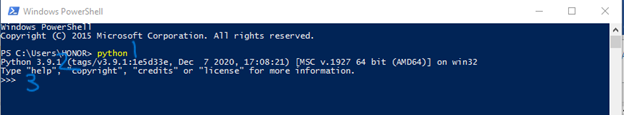
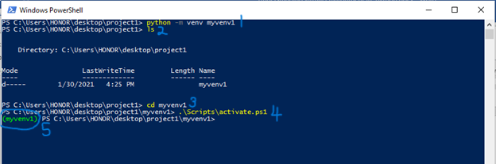
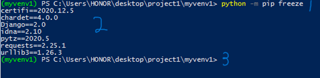

# Quick Start Guide: Creating a Python Virtual Environment (VENV) Using PowerShell

## Audience

This guide is designed for beginner Python developers in the Ensign College academic community who are new to managing project dependencies and need a simple, reliable way to isolate project environments on Windows.

## What You Will Achieve

By the end of this guide, you will be able to:

- Create a Python virtual environment (venv)
- Activate and use the virtual environment
- Install project-specific packages
- Save and reuse project dependencies across systems

## Why This Matters

When working on multiple Python projects, different projects often require different versions of libraries such as Flask or Django. Without a virtual environment, installing or upgrading a package can break existing projects. A virtual environment solves this problem by creating an isolated space where each project can manage its own dependencies independently. This ensures consistency, prevents conflicts, and makes your projects easier to maintain and deploy.

## Prerequisites

Before you begin, ensure you have:

- A Windows computer
- Python 3.4 or higher installed
- Basic familiarity with using PowerShell

---

## Step 1: Open PowerShell

Open PowerShell by typing "PowerShell" into the Windows search bar and selecting the application. PowerShell is a command-line interface that allows you to interact with your system using commands.

---

## Step 2: Verify Python Installation

In PowerShell, type the following command:

```powershell
python --version
```

If Python is installed, you will see the version number displayed. This confirms that Python is correctly installed and accessible from the command line. You should see something similar to what is on the figure 1 below.



**Figure 1: How to verify that Python is installed successfully in Windows PowerShell.**

### Annotations

**[1] Python command entered**  
This is the command `python` typed into PowerShell to check if Python is installed and accessible from the system PATH.

**[2] Python version output**  
This output confirms the installed Python version (Python 3.9.1 in this case). It shows that Python is correctly installed and recognized by the system.

**[3] Interactive Python prompt (>>> )**  
This indicates that Python has launched successfully in interactive mode. It confirms the installation is working correctly and ready for use.

If the command is not recognized, download and install Python from https://www.python.org/downloads/ and ensure the "Add Python to PATH" option is selected during installation.

Note: To exit the python interaction session and return to normal PowerShell terminal prompt, type the following command.

```powershell
exit()
```

---

## Step 3: Verify pip Installation

Run the following command:

```powershell
pip --version
```

PIP comes pre-undled together with python, so it should automatically instal together with python. If pip is installed, you will see version information displayed. Pip is the package manager used to install Python libraries.

If pip is not recognized, reinstall Python and ensure pip is included in the installation.

---

## Step 4: Create a Project Folder

Navigate to your desired location and create a project folder:

```powershell
cd Desktop
mkdir project1
cd project1
```

These commands move you to the Desktop, create a new folder named "project1," and open it. All your project files and virtual environment will be stored here.

---

## Step 5: Create a Virtual Environment

Run the following command to create a virtual environment:

```powershell
python -m venv myenv1
```

This command creates a new folder named "myenv1" inside your project directory. This folder contains all the files required to run an isolated Python environment.

If the command executes successfully, no message will appear. If an error occurs, ensure Python is properly installed and available in your system PATH.

---

## Step 6: Activate the Virtual Environment

Activate the virtual environment with:

```powershell
.\Scripts\Activate.ps1
```

### Expected Result

You should see the environment name appear at the beginning of your terminal prompt, like this:

```
(myenv1) PS C:\Users\...\project1>
```



#### Figure 2: Creating and Activating a Python Virtual Environment in PowerShell

This figure shows the process of creating and activating a Python virtual environment using Windows PowerShell.

### Annotations

**[1] Create virtual environment command**  
This command creates a new virtual environment named `myvenv1` using Python’s built-in `venv` module.

**[2] Directory listing confirmation**  
This shows the contents of the current project folder, confirming that the `myvenv1` folder was successfully created.

**[3] Navigate into project directory**  
This command changes the working directory into `myvenv1`.

**[4] Activate virtual environment script**  
This runs the activation script for the virtual environment in PowerShell.

**[5] Activated environment indicator**  
The `(myvenv1)` prefix confirms that the virtual environment is active. Any Python packages installed now will stay isolated inside this environment.

This indicates that the virtual environment is active. While active, any packages you install will only apply to this environment.

---

## Step 7: Install Required Packages

Install packages using pip:

```powershell
pip install flask
```

This command installs the Flask library within your virtual environment. You can replace "flask" with any package your project requires.

After installation, pip will display messages confirming that the package was successfully installed.

---

## Step 8: View Installed Packages

To see all installed packages, run:

```powershell
pip freeze
```

This command lists all installed packages along with their versions. This is useful for tracking dependencies in your project.



#### Figure 3: Checking Installed Packages in the Activated Virtual Environment

This figure shows how to verify installed Python packages inside an active virtual environment using `pip freeze`.

### Annotations

**[1] Command to list installed packages**  
The command `python -m pip freeze` is used to display all Python packages installed in the current virtual environment along with their versions.

**[2] Installed package list output**  
This section shows the installed packages in the environment, such as:

- certifi
- chardet
- Django
- idna
- pytz
- requests
- urllib3

These packages confirm that the virtual environment is active and managing its own dependencies separately from the global Python installation.

**[3] Virtual environment prompt indicator (implicit context)**  
The `(myvenv1)` prefix in the terminal confirms that all packages listed belong only to this isolated environment, not the system-wide Python installation.

---

## Step 9: Save Dependencies to a File

To save installed packages for reuse, run:

```powershell
pip freeze > requirements.txt
```

This creates a file named "requirements.txt" containing all installed packages and their versions. This file is useful when sharing your project or deploying it to another system.

---

## Step 10: Install Dependencies from File

To install or re-install all dependencies from the file, run:

```powershell
pip install -r requirements.txt
```

This command reads the requirements file and installs all listed packages automatically.

---

## Step 11: Deactivate the Virtual Environment

When you are done working in the virtual environment, you can deactivate it by running:

```powershell
deactivate
```

This returns your terminal to the global Python environment.

---

## Troubleshooting Tips

- If you see `'python' is not recognized`, Python is not added to your system PATH. Reinstall Python and enable the PATH option on the installation setup window.
- If activation of the virtual environment fails after it was created successfully, run PowerShell as Administrator and execute:
  ```powershell
  Set-ExecutionPolicy RemoteSigned
  ```
- If pip is not recognized, reinstall Python and ensure pip is included.

---

## Conclusion

Using a virtual environment is an essential practice for Python development. It allows you to manage dependencies efficiently, avoid conflicts between projects, and maintain clean, organized workflows. Whether you are working on personal projects or collaborating with others, virtual environments ensure your setup remains consistent and reliable.
